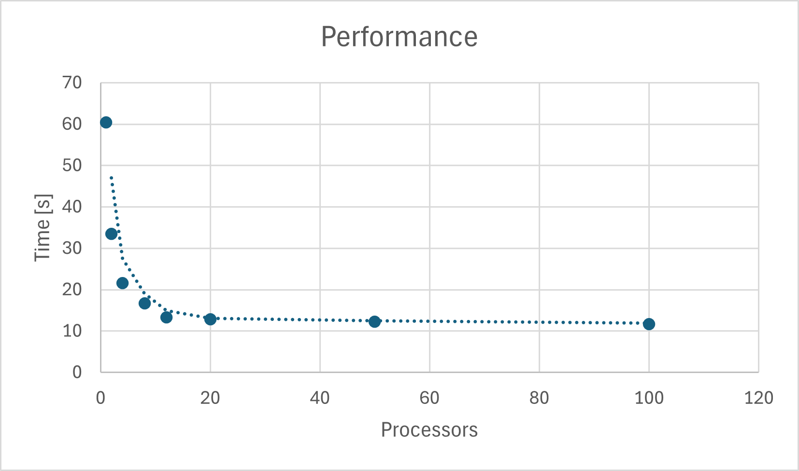

# System Programming Lab 11 Multiprocessing

## Overview
This program generates Mandelbrot images and combines them into a smooth zoom animation.

### Files
`jpegrw.c` Handles reading and writing JPEG files 
`mandel.c` Generates a single image at a given position, zoom, and resolution.
`mandelMovie.c` Creates multiple image frames by repeatedly running mandel with different zoom levels. It uses multiprocessing to render several frames in parallel.

## Compilation
to compile everything run `make`

## Running
### Generate one image
`./mandel -x 0 -y 0 -s 4 -o test.jpg` 

This creates `test.jpg` centered at (0, 0) with scale 4.

### Generate a movie sequence
`./mandelMovie -p 12 -f 80 -x 0.75 -y 0.1 -s 0.25 -z 0.96 -o movie`
- `-p <numChildren>` Number of simutaneous processes. Default 1
- `-f <numFrames>` Number of total frames. Default 10
- `-x <xCenter>` X center coordinate. Default 0.0
- `-y <yCenter>` Y center coordinate. Default 0.0
- `-s <scale>` Starting zoom scale. Default 4.0
- `-z <zoomFactor>` Zoom multiplier per frame. Default 0.9
- `-o <prefix>` Output filename prefix. Default mandel

For example: `./mandelMovie -p 4 -f 50 -x -0.761574 -y -0.0847596 -s 0.05 -z 0.96 -o spiral` creates frames `spiral0.jpg, spiral1.jpg, spiral2.jpg, ...`

### Creating the movie
Once the frames are generated, combine them using FFmpeg
`ffmpeg -framerate 24 -i movie%d.jpg -pix_fmt yuv420p movie.mp4`
- `-framerate 24` Plays at 24 frames per second
- `-i movie%d.jpg` Uses sequential files (movie0.jpg, movie1.jpg, etc)
- `-pix_fmt yuv420p` Ensures compatibility with most players
- `movie.mp4` Output video file

### Cool Videos to Try
`./mandelMovie -p 8 -f 80 -x -0.75 -y 0.1 -s 0.25 -z 0.96 -o migraine`
`./mandelMovie -p 50 -f 175 -x 0.00164365 -y -0.822467633 -s 0.9 -z 0.93 -o doublespiral`

#### Double Spiral Movie

## Benchmarking

Adding more processors sped up the program significantly until it maxed out around 12. The tests were done generating 20 frames.

